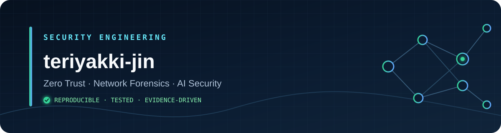

<p align="center">
  
</p>

<p align="center">
  <a href="https://teriyakki-jin.github.io/">Portfolio</a> ·
  <a href="https://github.com/teriyakki-jin?tab=repositories">Repositories</a> ·
  <a href="https://github.com/teriyakki-jin/zero-trust-network-lab">Featured Lab</a>
</p>

재현 가능한 실습 환경을 만들고, 보안 주장을 테스트와 실행 증거로 검증합니다.<br>
I build reproducible security systems and validate security claims with tests and execution evidence.

## Current focus

- Identity- and context-aware access control with zero-trust architecture
- Network detection engineering and forensic evidence pipelines
- AI agent runtime security, LLM gateways, and policy-as-code

## Featured security projects

| Project | What it demonstrates | Evidence |
|---|---|---|
| [Zero Trust Network Lab](https://github.com/teriyakki-jin/zero-trust-network-lab) | Keycloak identity, FastAPI PEP, OPA policy decisions, isolated Docker data plane | OPA `6/6` · integration `7/7` · CI |
| [Agent Runtime Security Lab](https://github.com/teriyakki-jin/agent-runtime-security-lab) | Intent/runtime correlation, OPA controls, Tetragon eBPF telemetry, OCSF evidence | recall `100%` · false positives `0%` in local fixtures |
| [Network Forensics Lab](https://github.com/teriyakki-jin/network-forensics-lab) | Reproducible attack traffic, Snort/Suricata cross-validation, Elastic visualization | 6 scenarios · 45/45 alerts · 91% coverage |
| [LLM Security Gateway](https://github.com/teriyakki-jin/llm-security-gateway) | Prompt-injection and PII controls over an ML-KEM-768/X25519 hybrid channel | Python + Go · FIPS 203-oriented design |
| [SecureScope](https://github.com/teriyakki-jin/SecureScope) | Lightweight SIEM with rule-based detection, tamper-evident logs, and live dashboards | Spring Boot · PostgreSQL · Redis · React |

> Measurements above are repository-scoped local validation results, not claims about production performance.

## Toolbox

**Security & platform**


**Engineering**


## How I work

```text
threat model → fail-closed design → policy as code → automated validation → reviewable evidence
```

- Keep credentials and tokens out of source control and screenshots.
- Separate control, enforcement, and protected-resource boundaries.
- Document limitations as carefully as successful results.
- Prefer repeatable test fixtures and CI over screenshots alone.

## Portfolio

Project context, architecture, and selected demos are available at **[teriyakki-jin.github.io](https://teriyakki-jin.github.io/)**.
